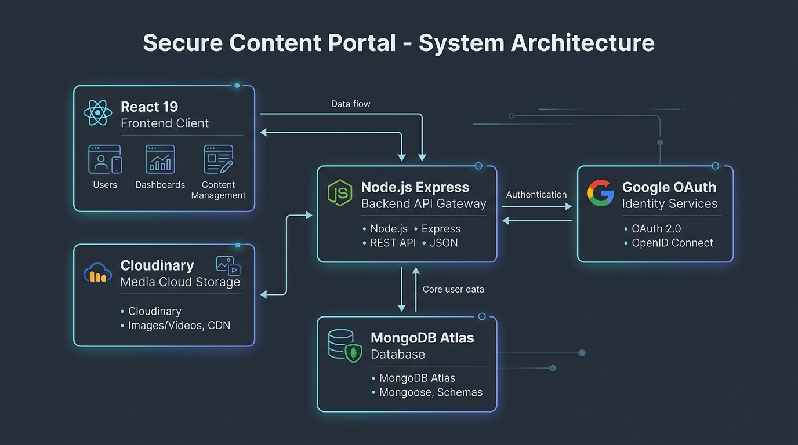

# Secure Content Portal

A full-stack web application for securely sharing **videos**, **PDFs**, **HTML pages**, and **Markdown documents** with role-based access control (**Admin** and **Viewer**).

---

## 1. Project Overview

Secure Content Portal is a full-stack content management and secure delivery system featuring role-based access control:
- **Admin**: Uploads MP4 videos, PDFs, HTML, and Markdown (.md) documents, edits metadata, deletes content (with two-step confirmation), monitors usage analytics (views and last-viewed timestamps), and inspects an audit trail of administrative actions.
- **Viewer**: Discovers and accesses reference material via protected, inline streaming viewers. Viewers cannot see administrative controls or access admin API endpoints.
- **Content Protection**: Eliminates direct public file URLs. Content is streamed exclusively through an authenticated, token-gated backend proxy endpoint supporting HTTP 206 Range Requests for video, canvas-rendered PDF pages with dynamic security watermarking, sandboxed iframe delivery for HTML, and authenticated reader rendering for Markdown.

---

## 2. Features Implemented

| Feature | Description |
| --- | --- |
| **Google OAuth 2.0 Sign-In** | User authentication via Google Identity Services (GIS). Google ID tokens are verified server-side using the `google-auth-library`. |
| **Role-Based Access Control (RBAC)** | Server-side RBAC with two roles (`admin` and `viewer`). First-time users default to `viewer`, while admin privileges are granted based on the `ADMIN_EMAILS` environment variable. |
| **HttpOnly Cookie Sessions** | Sessions are managed securely using JWTs stored in `HttpOnly`, `SameSite` cookies to mitigate XSS attacks. No access tokens are stored in `localStorage`. |
| **Admin Content Management** | Admins can upload MP4 videos, PDFs, HTML files, and Markdown documents with titles, descriptions, and categories; edit metadata; and delete items with two-step confirmation dialogs. |
| **Protected Proxy Streaming** | Permanent cloud storage URLs are never exposed to the client. All media is proxied through an authenticated backend route (`/api/content/:id/stream`). |
| **HTTP 206 Video Streaming** | Full support for HTTP 206 Range Requests enables smooth video seeking. Includes context menu suppression and `controlsList="nodownload"` attributes. |
| **Canvas PDF Rendering** | PDFs are fetched via authenticated proxy and rendered page-by-page onto an HTML5 `<canvas>` using PDF.js and an offline worker, completely bypassing native browser download affordances. |
| **Sandboxed HTML Delivery** | HTML content is served with strict Content-Security-Policy headers inside an `iframe` with `sandbox="allow-scripts"` to prevent script injection into the host application. |
| **Markdown Document Viewer** | Authenticated reader with dual-mode toggle (formatted rendered view and raw source view) with dynamic watermark overlay. |
| **File Validation & Sniffing** | Validates MIME types and checks true magic-byte file signatures (`%PDF-`, `ftyp`, `<`, `.md`) with strict file-size limits before storage. |
| **Search & Filtering** | Instant client-side search across titles and descriptions, with filtering by content type (Video, PDF, HTML, Markdown) and category. |
| **Usage Analytics** | Tracks per-item view counts and last-viewed timestamps, visible exclusively to administrators on content cards and the Admin Dashboard. |
| **Dynamic Watermarking** | Viewer email and active timestamp are subtly overlaid across video, PDF, and Markdown views to deter unauthorized screen recording and screenshots. |
| **Administrative Audit Trail** | Logs admin actions (content upload, update, deletion) with actor email and timestamp, accessible via the Admin Dashboard. |

---

## 3. Tech Stack

| Layer | Technology | Purpose |
| --- | --- | --- |
| **Frontend** | React 19, Vite, React Router 7, Axios, Lucide Icons | Client-side SPA with responsive UI |
| **Backend** | Node.js (Express 5), Multer, Cookie-Parser, Helmet | REST API, streaming proxy, and RBAC |
| **Auth** | Google Identity Services, Google Auth Library, JWT | Google OAuth & HttpOnly cookie sessions |
| **Database** | MongoDB Atlas / Mongoose | Metadata, users, usage stats, and audit logs |
| **Storage** | Cloudinary (Free Tier) | Encrypted cloud object storage with signed URLs |
| **PDF Viewer** | PDF.js (`pdfjs-dist`) | Canvas rendering without native PDF download controls |
| **Video Engine** | HTML5 Video + HTTP 206 Partial Content | Streaming playback and seeking without raw file URLs |

---

## 4. Architecture



### System Flow

- **(1) Authentication & Session**:
  - `POST /api/auth/google` -> verify token via `google-auth-library`
  - Query/create user in MongoDB (default role: `viewer`)
  - Set signed `HttpOnly` `session_token` cookie (`SameSite`, `secure` in production)
  - `GET /api/auth/me` -> validate cookie & restore session state

- **(2) Content Discovery & Metadata**:
  - `GET /api/content` -> retrieve content catalog (metadata only, no direct storage URLs)
  - Role-aware response: analytics (`views`, `lastViewedAt`) returned only to Admins
  - Client-side real-time search & type/category filters

- **(3) Token-Gated Content Streaming**:
  - `GET /api/content/:id/stream` (Authenticated via `HttpOnly` cookie)
  - Express fetches signed stream from Cloudinary (storage URLs never exposed)
  - Records view analytics (increments `viewCount`, updates `lastViewedAt`)
  - Multi-format handling:
    - **Video**: Proxies HTTP 206 Partial Content (Range requests)
    - **PDF**: Binary stream -> PDF.js canvas renderer + dynamic watermark
    - **HTML**: Sandboxed iframe delivery with strict CSP headers
    - **Markdown**: UTF-8 stream -> client-side parsed HTML / raw toggle

- **(4) Admin Operations & Audit Trail (`requireAdmin`)**:
  - `POST /api/content` -> multer temp upload -> magic-byte check -> Cloudinary upload -> MongoDB record -> AuditLog
  - `PUT /api/content/:id` -> update metadata in MongoDB -> AuditLog
  - `DELETE /api/content/:id` -> delete from Cloudinary & MongoDB -> AuditLog
  - `GET /api/content/audit-logs` -> fetch administrative activity log

---

## 5. Security Architecture & Trade-Offs

### Security Protections Implemented
1. **No Permanent Public Links**: Permanent Cloudinary storage URLs are never transmitted to the client. The browser network tab only sees requests to the application's own `/api/content/:id/stream` endpoint.
2. **Token-Gated Access**: The streaming endpoint requires a valid, authenticated session. If an unauthorized party copies the stream URL, the request is rejected with `401 Unauthorized`.
3. **HTTP 206 Range Request Streaming**: Videos are streamed incrementally rather than served as full downloadable files. The `<video>` player includes `controlsList="nodownload"` and right-click context menu prevention.
4. **Canvas-Rendered PDFs**: PDFs are rendered page-by-page directly onto HTML5 `<canvas>` elements using PDF.js. No browser-native PDF viewer (with download/print buttons) is ever shown.
5. **Sandboxed HTML**: HTML content is served with strict Content-Security-Policy headers inside an iframe configured with `sandbox="allow-scripts"`, preventing cross-site scripting or parent window manipulation.
6. **HttpOnly Cookie Sessions**: Session tokens are transmitted exclusively in `HttpOnly`, `SameSite=Lax` cookies, neutralizing token theft via XSS. No tokens are stored in `localStorage`.
7. **Deep File Validation**: Uploaded files are inspected for real magic bytes (`%PDF-`, `ftyp`, `<`, `.md`) and enforce hard size limits.
8. **Subtle Security Watermarking**: The viewer's authenticated email and timestamp are stamped diagonally across PDF pages and overlaid over videos to deter unauthorized screen captures.

### Real Boundaries vs. Deterrents
- **Real Boundaries**: Server-side RBAC, HttpOnly session cookies, token-gated backend proxying, backend file signature sniffing, and sandboxed HTML iframes. A non-admin cannot perform admin operations even if they craft custom HTTP requests. An unauthenticated user cannot access content bytes.
- **Deterrents**: UI right-click suppression, `controlsList="nodownload"`, and watermark overlays. In any web application, bytes that reach the client's screen can theoretically be recorded or captured by a determined actor with screen recording tools or root debugger access.
- **Future Enhancements**: Expiring session-bound streaming tokens with DRM (e.g. Apple FairPlay / Widevine via HLS/DASH), dynamic stenographic watermarking, and IP/geolocation anomaly detection.

---

## 6. Environment Configuration

### Server Configuration (`server/.env`)

```ini
PORT=5000
NODE_ENV=development
MONGODB_URI=mongodb+srv://<username>:<password>@<cluster>.mongodb.net/secure-content-portal?retryWrites=true&w=majority
GOOGLE_CLIENT_ID=your-client-id.apps.googleusercontent.com
ADMIN_EMAILS=admin@example.com,your-email@gmail.com
CLOUDINARY_CLOUD_NAME=your_cloud_name
CLOUDINARY_API_KEY=your_api_key
CLOUDINARY_API_SECRET=your_api_secret
FRONTEND_URL=http://localhost:5173
JWT_SECRET=your_jwt_secret_key
```

### Client Configuration (`client/.env`)

```ini
VITE_API_BASE_URL=
VITE_GOOGLE_CLIENT_ID=your-client-id.apps.googleusercontent.com
```

---

## 7. Localhost Setup & Running

### Prerequisites
- Node.js 18+
- Active MongoDB database (local or Atlas)
- Cloudinary free-tier credentials

### Setup Steps
1. **Clone the repository and install dependencies**:
   ```bash
   npm install
   npm run install:all
   ```

2. **Configure environment files**:
   ```bash
   cp server/.env.example server/.env
   cp client/.env.example client/.env
   ```

3. **Start the development servers**:
   ```bash
   npm run dev
   ```
   - Frontend is available at: **<http://localhost:5173>**
   - Backend API is available at: **<http://localhost:5000/api/health>**

---

## 8. Free-Tier Deployment Guide

| Component | Recommended Platform | Deployment Steps |
| --- | --- | --- |
| **Frontend** | Vercel / Netlify | Root directory: `client`. Build command: `npm run build`. Output directory: `dist`. Env vars: `VITE_GOOGLE_CLIENT_ID`, `VITE_API_BASE_URL` (points to backend URL). |
| **Backend** | Render / Railway | Root directory: `server`. Build command: `npm install`. Start command: `node server.js`. Add environment variables from `server/.env.example`. |
| **Database** | MongoDB Atlas | Free M0 sandbox cluster. Set Network Access to `0.0.0.0/0`. |
| **Storage** | Cloudinary | Free tier account for image, raw, and video storage. |
| **Auth** | Google Cloud Console | Create OAuth 2.0 Client ID. Add deployed frontend URL to *Authorized JavaScript origins*. |
